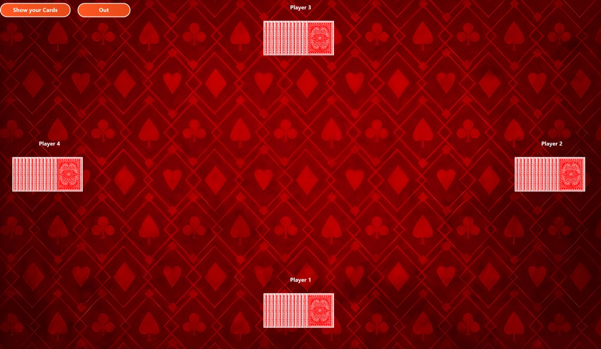
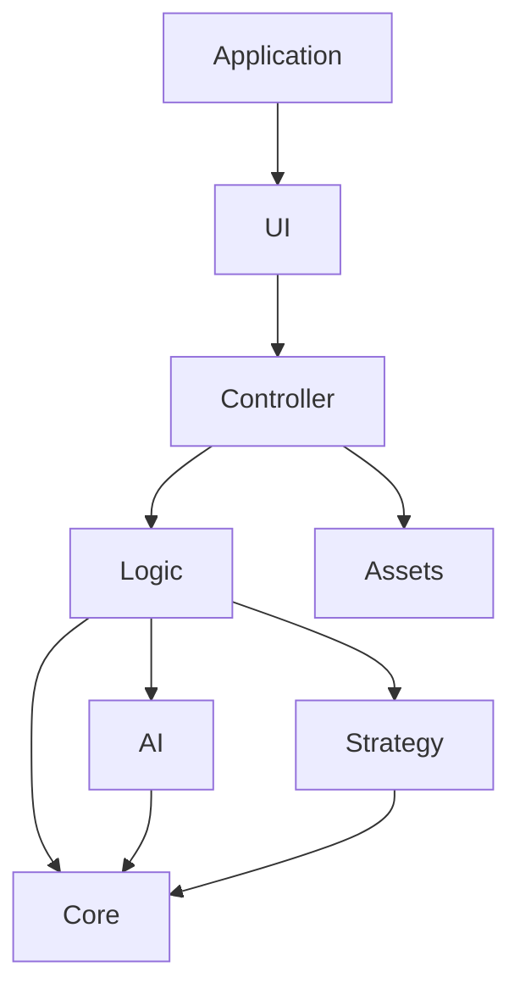

# Vietnamese Card Game

A desktop card-game application built with Java 17 and JavaFX. It implements three Vietnamese game variants on top of a reusable, generic card engine:

- Tiến Lên Miền Nam (Southern Tiến Lên)
- Tiến Lên Miền Bắc (Northern Tiến Lên)
- Ba Cây

The project was developed for the Object-Oriented Programming course. The design focuses on reusable domain models, interchangeable rule and AI strategies, and separation between game logic and the JavaFX interface.



## Highlights

- Supports 2-4 players in both Tiến Lên variants and 2-8 players in Ba Cây.
- Allows any supported mix of local human players and computer-controlled players.
- Implements separate validators for the Northern and Southern Tiến Lên rules.
- Provides graphical card assets and a lightweight basic rendering mode.
- Uses bounded Monte Carlo rollouts to evaluate AI moves without mutating the live game.
- Includes random, greedy, and backtracking AI strategy implementations for extension or experimentation.
- Uses generic card, deck, player, game, scoring, ordering, and comparison abstractions.
- Builds and runs through Maven without a separately installed JavaFX SDK.
- Includes automated tests for the deck, scoring, dealing, player limits, opening rules, regional combinations, and Monte Carlo state isolation.

## Architecture

The codebase combines MVC-style presentation boundaries with Factory, Strategy, and Template Method patterns.



| Package | Responsibility |
| --- | --- |
| `application` | JavaFX entry point and application bootstrap |
| `ui.view` | Scene construction, responsive seat layout, and user interaction |
| `controller` | Coordination between views and game models |
| `logic` | Ba Cây and regional Tiến Lên rules |
| `core` | Generic cards, decks, players, collections, and game contracts |
| `strategy` | Card ordering, comparison, sorting, and scoring policies |
| `ai` | Pluggable move-selection strategies |
| `assets` | Card images, backgrounds, and sound loading |

The generic types prevent incompatible card and game types from being combined at compile time. Concrete rules remain outside the core model, while factories keep UI startup code independent of specific game implementations.

## Technology

- Java 17
- JavaFX 21
- Maven
- JUnit 5
- FXML

## Getting started

### Prerequisites

- JDK 17 or newer
- Maven 3.8 or newer

Check your installation:

```bash
java -version
mvn -version
```

### Run the application

```bash
git clone <repository-url>
cd Card-Game
mvn clean javafx:run
```

Maven downloads the JavaFX dependencies for the current platform. No manual JavaFX SDK or IDE-specific library configuration is required.

### Run the tests

```bash
mvn clean test
```

The current suite contains 14 automated tests.

### Build the project

```bash
mvn clean package
```

The compiled JAR is written to `target/card-game-1.0.0.jar`. Because JavaFX uses platform-specific native libraries, `mvn javafx:run` is the simplest way to launch the application during development.

## How to play

1. Select one of the three game variants.
2. Enter the number of human players and bots. The total must be within the limit displayed on screen.
3. Select **Đẹp** for graphical cards or **Cơ bản** for basic rendering.
4. Start the game.

### Tiến Lên

- Select **Show your Cards** when it is your turn.
- Click cards to select or deselect them.
- Select **Hit** to play a valid combination.
- Select **Skip** to pass.
- Computer-controlled turns run automatically.
- The match ends after the finishing order has been determined.

### Ba Cây

- Select **Show** to reveal each hand in sequence.
- Select **Show Results** after all hands have been revealed.
- The application ranks players by the ones digit of the three-card total.

The interface labels are currently in Vietnamese, while the gameplay action labels are partly in English.

## Project structure

```text
src/
├── main/
│   ├── java/
│   │   ├── module-info.java
│   │   └── edu/hust/cardgame/
│   └── resources/
│       ├── card/
│       ├── sound/
│       └── edu/hust/cardgame/ui/fxml/
└── test/
    └── java/edu/hust/cardgame/
```

## Extending the project

To add another card game:

1. Define or reuse a `CardType` and `DeckFactory`.
2. Implement the rules as a `CardGame` subclass or one of the narrower game interfaces.
3. Add ordering, comparison, scoring, or AI strategies only where the new rules need them.
4. Add a controller and a `GameScene` implementation.
5. Register both in `GameControllerFactory`, `GameSceneFactory`, and the game-selection list.
6. Add rule-level and integration tests for the new variant.


## Current scope

- Multiplayer is local on one computer.
- AI difficulty is not exposed as a UI setting. Tiến Lên currently uses the Monte Carlo strategy by default.
- The application does not persist matches or player profiles.
- The automated suite focuses on domain rules and AI state safety. End-to-end JavaFX interaction tests are not included yet.
